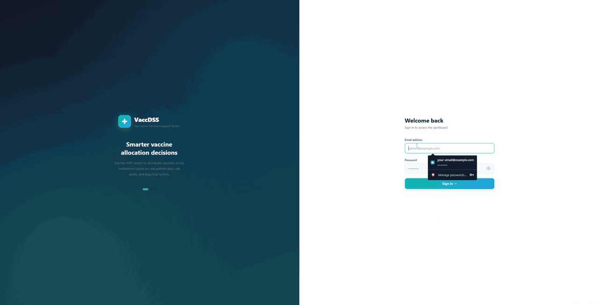
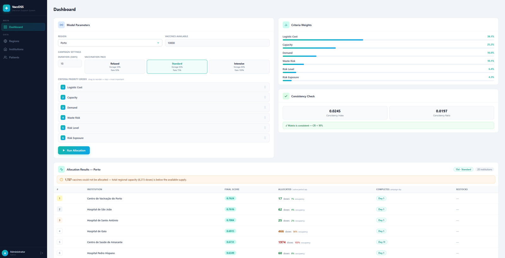
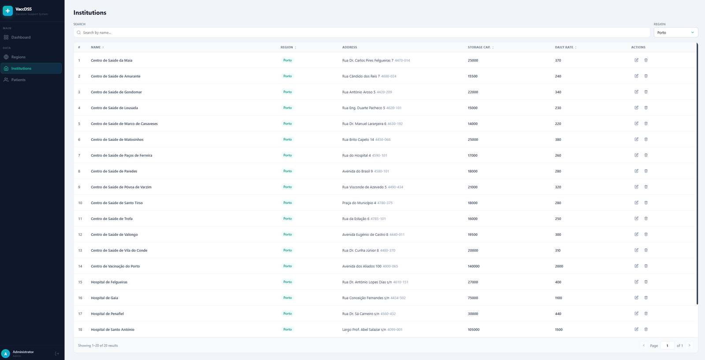
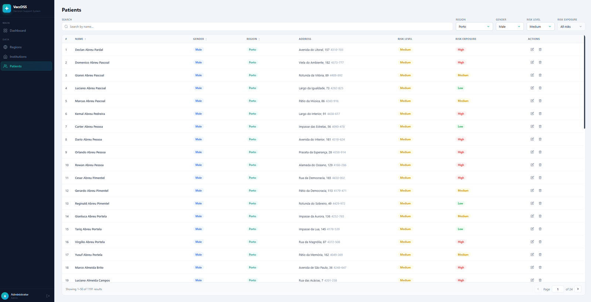
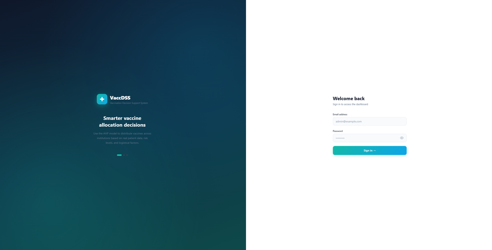

# VaccDSS: Vaccination Decision Support System

A full-stack web app that helps health authorities decide **how many vaccine doses each institution in a region should receive** during a vaccination campaign.

You choose a region, the number of doses and the campaign length, then rank six criteria by importance. The system assigns patients to their nearest institutions, weighs the criteria with the **AHP (Analytic Hierarchy Process)** method, and returns a per-institution allocation with completion days, occupancy and restock planning.

> Individual project for the MSc in Biomedical Engineering at ISEP (Instituto Superior de Engenharia do Porto). I designed and built the whole stack: database, REST API and Angular frontend.



| Allocation dashboard | Institutions |
|----------------------|--------------|
|  |  |

| Patients | Login |
|----------|-------|
|  |  |

## Features

- **Allocation dashboard**: pick a region, doses, campaign days and vaccination pace, then drag and drop the criteria into priority order.
- **AHP weighting**: turns the ranking into weights and reports the consistency ratio (CR).
- **Distance-based patient assignment**: each patient goes to the nearest institution, with overflow to the next nearest when one is full (PostGIS distances).
- **Per-institution results**: score, allocated doses, completion day, occupancy and restock days.
- **Data management**: regions, institutions and patients, with filtering, sorting, pagination and soft delete.
- **Authentication**: JWT login, a route guard, and automatic logout when the token expires.

## Tech stack

| Layer | Technology |
|-------|------------|
| Frontend | Angular 21 (standalone components, signals, reactive forms, CDK drag-and-drop), TypeScript |
| Backend | Java 21, Spring Boot, plain JDBC with parameterised queries |
| Database | PostgreSQL + PostGIS (hosted on Supabase) |
| Auth | JWT |

## How the allocation works

1. **Capacity**: the vaccination pace (relaxed, standard or intensive) sets how much of each institution's storage and daily rate is used.
2. **Patient assignment**: patients are assigned nearest-first. When an institution reaches the number of patients it can vaccinate during the campaign, the rest move on to their next-nearest institution.
3. **AHP weights**: the criteria ranking becomes a pairwise comparison matrix. Weights are calculated with the geometric mean method, followed by a consistency check.
4. **Scoring**: each institution gets a score from demand, risk level, risk exposure, logistic cost, capacity and waste risk.
5. **Distribution**: doses are split in proportion to the scores, capped by what each institution can administer, and any remainder goes to the highest-scoring institutions.

The full formulas and examples are in [docs/DOCUMENTATION.md](docs/DOCUMENTATION.md).

## Project structure

```
BE/vaccination-DSS-BE/   Spring Boot REST API
FE/vaccination-DSS-FE/   Angular frontend
docs/                    Documentation, database schema and sample data
```

## Running locally

### Prerequisites

- [Java 21](https://adoptium.net/temurin/releases/?version=21) (or a JDK 21 configured in IntelliJ IDEA)
- [Node.js](https://nodejs.org/) LTS (20, 22 or 24) and npm
- A PostgreSQL client to load the sample data (e.g. DBeaver, psql or the Database tool in IntelliJ IDEA Ultimate)
- A PostgreSQL database with the PostGIS extension (a free Supabase project works)

### Database

1. **Create a Supabase project** at [supabase.com](https://supabase.com). Choose a database password and save it, because you'll need it below. Login uses Supabase Auth, so the schema is written for Supabase.

   Under **Security**, untick *Automatically expose new tables* and tick *Enable automatic RLS*. The app connects directly to the database and doesn't use Supabase's Data API, so this keeps your data from being exposed through it.
2. **Get the connection details.** Click **Connect** at the top of the project dashboard. You'll need:
   - **Host**: under *Direct connection*, e.g. `db.abcdefghijklmnop.supabase.co`. If your network doesn't support IPv6 and the connection fails, use the *Session pooler* host instead (e.g. `aws-0-eu-west-1.pooler.supabase.com`)
   - **Port**: `5432`
   - **User**: `postgres` for the direct connection, or `postgres.abcdefghijklmnop` for the session pooler
   - **Password**: the one from step 1. You can reset it under **Project Settings → Database** if you've lost it.
3. **Create the tables.** In Supabase's **SQL Editor**, run [`docs/schema.sql`](docs/schema.sql).
4. **Load the sample data.** [`docs/seed.sql`](docs/seed.sql) is about 14 MB, too large for the browser SQL Editor, so run it as a script from a PostgreSQL client connected with the details from step 2 (SSL mode `require`).

   The seed loads all 20 Portuguese districts and autonomous regions, 381 health institutions and a random sample of 50,000 patients from the simulated population.
5. **Create a login user** in Supabase under **Authentication → Users → Add user**, with *Auto Confirm User* ticked. Then run the `user_profiles` insert at the end of `seed.sql` in the SQL Editor, using that email.

### Backend

Fill in `BE/vaccination-DSS-BE/.env` with the details from step 2:

| Variable | Value |
|----------|-------|
| `DB_URL` | `jdbc:postgresql://<host>:5432/postgres?sslmode=require` |
| `DB_USERNAME` | `postgres` (direct) or `postgres.abcdefghijklmnop` (session pooler) |
| `DB_PASSWORD` | your database password |
| `JWT_SECRET` | a random Base64 key of 32+ bytes (see below) |

Generate `JWT_SECRET` with:

- macOS / Linux: `openssl rand -base64 32`
- Windows (PowerShell): `[Convert]::ToBase64String((1..32 | ForEach-Object { Get-Random -Maximum 256 }))`

Then start the API, either:

- **IntelliJ IDEA:** open the `BE/vaccination-DSS-BE` folder, set the project SDK to Java 21 (**File → Project Structure**) and run `VaccinationDssBeApplication`, or
- **Terminal:** from `BE/vaccination-DSS-BE`, run `./mvnw spring-boot:run` (macOS / Linux) or `mvnw spring-boot:run` (Windows)

The API runs on `http://localhost:8080`.

### Frontend

```bash
cd FE/vaccination-DSS-FE
npm ci
npm start
```

The app runs on `http://localhost:4200`. Log in with the user from step 5. The API address is set in `src/environments/`.

## Author

**João Vaguinho** · [LinkedIn](https://www.linkedin.com/in/jvaguinho)
